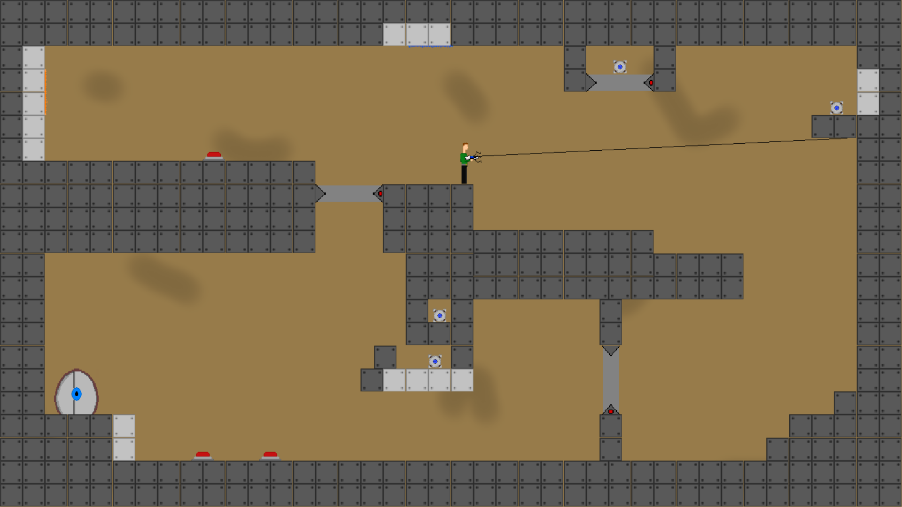

# Coding week project : 2D PORTAL GAME


An incredible game inspired by the legendary game PORTAL


## Project description

[Portal](https://fr.wikipedia.org/wiki/Portal_(jeu_vid%C3%A9o)) is a platform game where the player solves enigmas to progress through the levels.

Portal2D is a 2D adaptation of this masterpiece.

This game has the following features : 
 - An interactive menu with an option tab and a level tab.
 - Musics that fit the levels that can be cut.
 - An intuitive 2D platform game.
 - Smooth interactions between entities such as the player, movable cubes, doors, buttons.
 - 12 levels with a thoughfull design
 - Animated sprites
 - Ratio down the display to take into account different screen sizes
 - A brief story with two characters talking throught the levels
 - An easy way to implement levels through the use of a json file
 - An unlock system with a save implemented
 - End screen




## Requirements

This project requires [python 3](https://www.python.org/downloads/).

Required python module to start the game :

- [numpy](https://numpy.org/install/)
- [pygame](https://www.pygame.org/wiki/GettingStarted)

To install in the console :
```bash 
    pip install numpy
    pip install pygame
```
To start the game
```
    python interface.py
```
If you are a Windows user just start this file in the folder : start.bat

## Documentation

The code is split in a rather intuitive manner:

- affichage.py : functions to display the game are
- entite.py    : classes for game entities
- collision.py : functions to handle collisions between every entities
- utils.py     : utils functions
- UI.py        : UI classes
- interface.py : the core game code
- levels.json  : the levels are stored in a json to facilitate adding some
- /image       : folder that contains the source for images and music

The structure of the levels.json file : 
The screen is 2000x1100
```json
    "level<int>":{
        "dialogue":[{
               "dialogue_gentil_1": "En effet, Aperture Science recompense ses",
                "dialogue_gentil_2": "sujets avec un gateau! Ne vous inquietez pas",
                "dialogue_gentil_3": "28D774, on en donne aussi aux sujets defaillants.",
                "dialogue_villain_1": "Voici le Cube de Voyage, il vous accompagnera" ,
                "dialogue_villain_2": "jusqu a votre desinte#b75{k ?8@ !",
                "dialogue_villain_3": "Hum. Je veux dire jusqu a votre gateau. " 
                
                }]
    ,
        "info":{"gravity":1000,"porte":{"x":1800,"y":950,"sx":100,"sy":100}},
        "perso":{"x":100,"y":950,"sx":40,"sy":95},
        "blocs":[{"x":1400,"y":800,"sx":50,"sy":50,"repeat":1},{"x":1400,"y":750,"sx":550,"sy":50,"repeat":1},{"x":1050,"y":850,"sx":400,"sy":50,"repeat":1},{"x":0,"y":0,"sx":2000,"sy":50,"repeat":1},{"x":0,"y":50,"sx":50,"sy":1050,"repeat":1},{"x":1950,"y":50,"sx":50,"sy":1050,"repeat":1},{"x":50,"y":1050,"sx":1900,"sy":50,"repeat":1}],
        "boutons":[{"x":1800,"y":700,"sx":50,"sy":50},{"x":500,"y":1000,"sx":50,"sy":50},{"x":1200,"y":800,"sx":50,"sy":50}],
        "cubes":[{"x":300,"y":1000,"sx":30,"sy":30,"m":50},{"x":1100,"y":800,"sx":30,"sy":30,"m":50},{"x":1600,"y":700,"sx":30,"sy":30,"m":50}],
        "murs":[{"x":1010,"y":870,"sx":40,"sy":180,"condition":[0,1,2]}],
        "le_villain_commence":{"lvc":1}
    }
```

## Support

wassim.eljattari@student-cs.fr

## Roadmap

Add a multiplayer mode (a entire roadmap is available in Organisation.txt from line 197 to 215).

Add a barrier entity that forbid players to shoot portals through but still can go through .

Add a turret that shoots at the player.

Add a death screen and dialogue.

Add new levels (see documentation to view the structure).

Add new sounds.

## Contributing

If you want to contribute you can freely download the file as it is mostly opensource (the music aren't).

Contact me if you want to contribute directly to this git.

## Authors

Wassim El Jattari

Laurent Battistelli

Barbier Gaspard

Avenat Sylvain

Auvray Theo

Zachary Mathéo